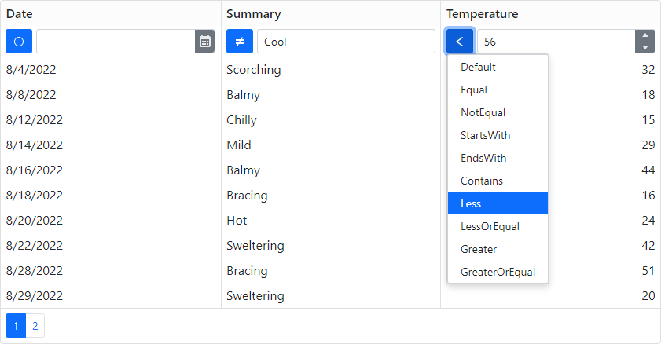

<!-- default badges list -->

<!-- default badges end -->

# Grid for Blazor - Incorporate a selector for filter row operator type

This example demonstrates how you can extend our Blazor Grid’s Filter Row with a custom operator selector.

Within each grid column, the [FilterRowCellTemplate](https://docs.devexpress.com/Blazor/DevExpress.Blazor.DxGridDataColumn.FilterRowCellTemplate) property specifies the template used for the filter row cell. The template contains an **OperatorType** component (see the [OperatorType.razor](./CS/DxGridFilterOperatorSelector/Components/OperatorType.razor) file). The component includes a DxButton that activates a dropdown window with a list of operators. When a user selects an operator, the column's [FilterRowOperatorType](http://docs.devexpress.devx/Blazor/DevExpress.Blazor.DxGridDataColumn.FilterRowOperatorType) property is set to the specified value and the column values are filtered.

## Files to Review

- [Grid.razor](./CS/DxGridFilterOperatorSelector/Pages/Grid.razor)
- [OperatorType.razor](./CS/DxGridFilterOperatorSelector/Components/OperatorType.razor)
